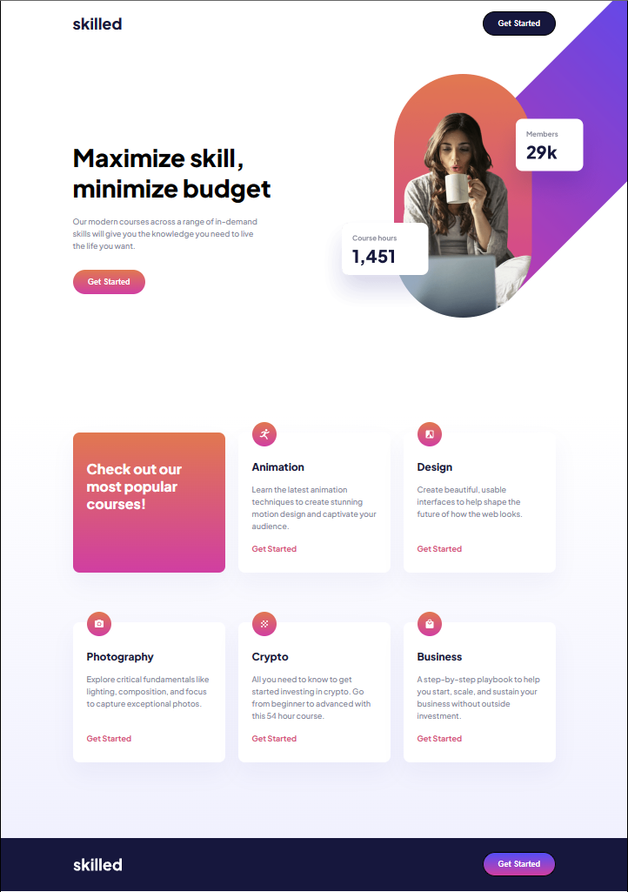
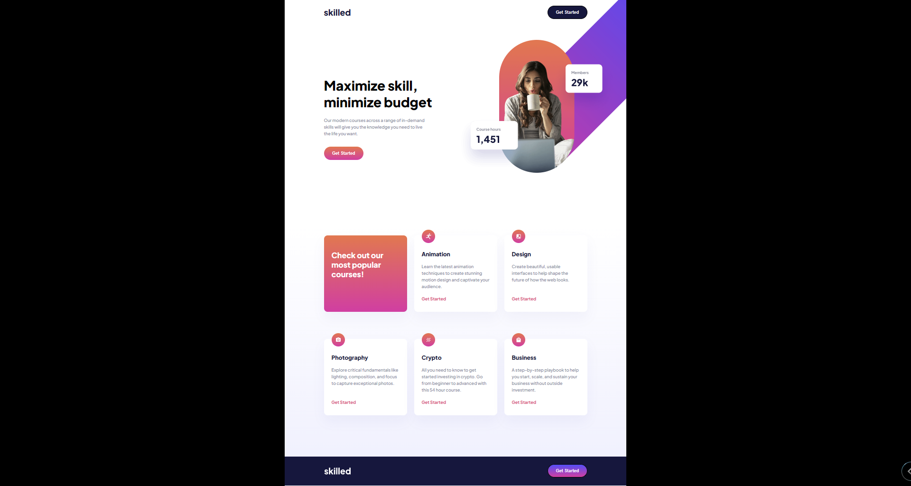
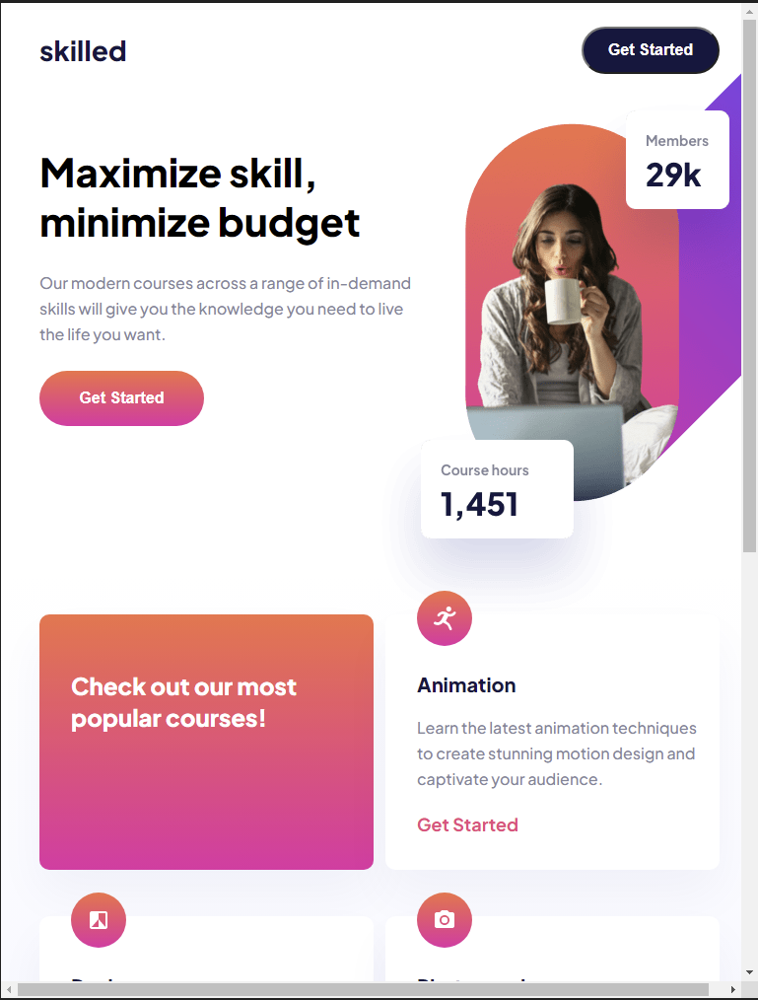
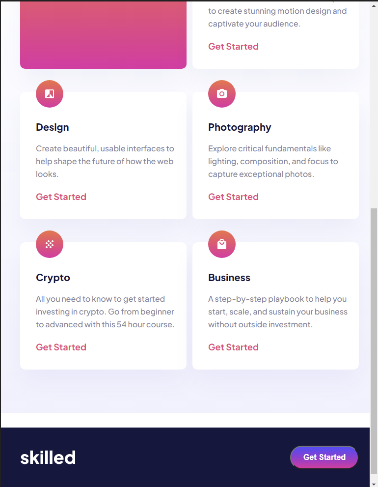
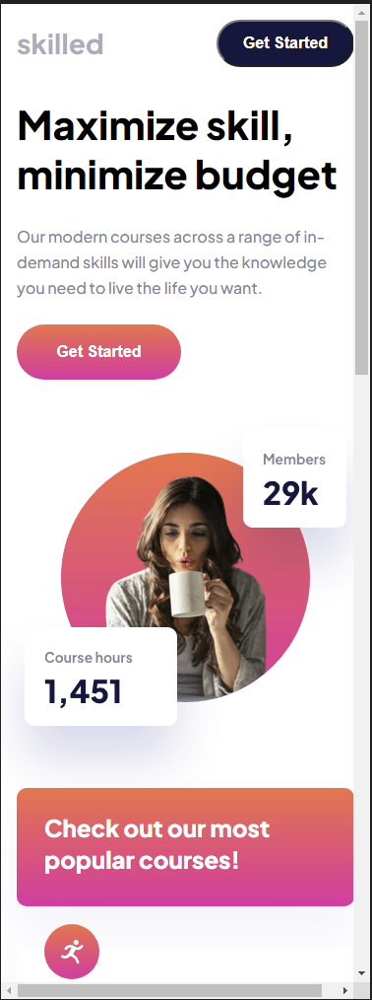
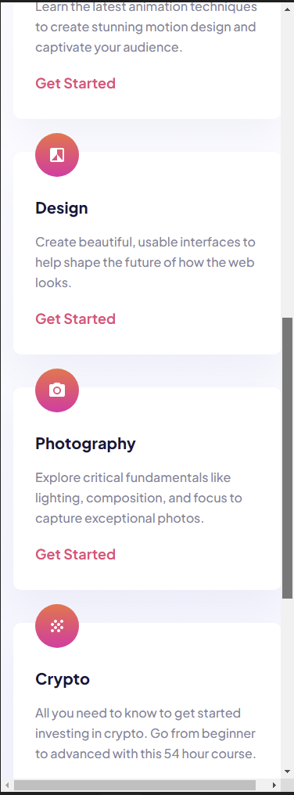
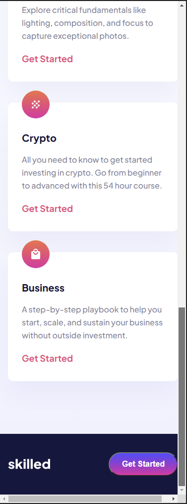

# Frontend Mentor - Skilled e-learning landing page solution

This is a solution to the [Skilled e-learning landing page challenge on Frontend Mentor](https://www.frontendmentor.io/challenges/skilled-elearning-landing-page-S1ObDrZ8q).

## Table of contents

- [Overview](#overview)
  - [The challenge](#the-challenge)
  - [Screenshot](#screenshot)
  - [Links](#links)
- [My process](#my-process)
  - [Built with](#built-with)
  - [What I learned](#what-i-learned)
  - [Continued development](#continued-development)
  - [Useful resources](#useful-resources)
- [Author](#author)
- [Acknowledgments](#acknowledgments)

## Overview

### The challenge

Users should be able to:

- View the optimal layout depending on their device's screen size
- See hover states for interactive elements

### Screenshot

### Links

- Solution URL: [Solution on GitHub](https://github.com/jguleserian/FMC-Skilled-Elearnng-Landing-Page)
- Live Site URL: [GitHub Pages](https://jguleserian.github.io/FMC-Skilled-Elearnng-Landing-Page/index.html)

## My process

### Built with

- Semantic HTML5 markup
- CSS custom properties
- Flexbox
- CSS Grid
- Mobile-first workflow
- Responsive Design

### What I learned

While building the initial project did not take a lot of time, the project ended up being quite a challenge. Some of these reasons are detailed below, but in short, working with multiple media queries and keeping track of where I am in the code (what section) led to copious errors and rewriting. Nevertheless, I learned a great deal of new things and honed some other skills.

In terms of conceptual/procedural development, what I picked up from this project include:
1. When listing the @media, you must start with the larger screen first, and leave the mobile for the bottom.
2. Developer tools: device emulation (awesome!!!), utilizing the style guides/overlays for the box model. 
3. One needs to be careful with longer style sheets. Always be careful to identify which part of the code one is changing or building. Many time I found I had changed something in the @media for the tablet section when I should have been in the mobile section. Mistakes like this cost a lot of time.
4. While setting the initial style for the css, especially when altering containers, it is helpful to put a 1px border around everythning to see how it one subsumes the other. Of course, when the dimensions are tight, the border may have to be taken off to ensure the font wraps correctly.

### Continued development

While I am anxious to try something more challenging, I think I want to try one more small project. After that, I would like to try a small project, or 2, incorporating Javascript and JQuery. Once I feel more comfortable with using vanilla JS, I would like to incorporate a project as part of an interface for Node, maybe in conjunction with a simple API.

## Author

Jeff Guleserian

- GitHub - [Jeff Guleserian on GitHub](https://github.com/jguleserian)
- Frontend Mentor - [@jguleserian](https://www.frontendmentor.io/profile/jguleserian)
- LinkedIn - [@yourusername](https://www.linked.com/jeffguleserian)

## Acknowledgments

Again, thank you for all my peer mentors out there who have given me pointers along the way and spurred me on to improve.